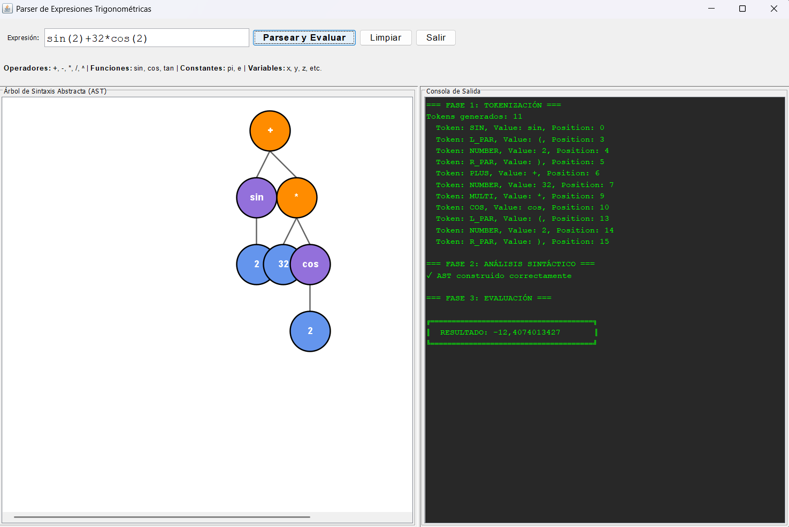
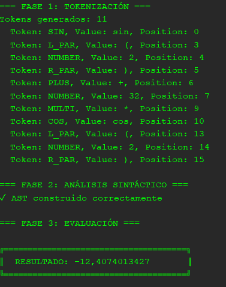

# Parser y Evaluador de Expresiones Trigonométricas


Sistema completo de análisis léxico, sintáctico y evaluación de expresiones matemáticas con funciones trigonométricas, implementado en Java con interfaz gráfica para visualización del AST.

**Proyecto de Compiladores - Universidad del Magdalena - 2024**

## 👥 Autores

- **Robert González** - [GitHub](https://github.com/robertJr18)
- **Jose Rodriguez** - [GitHub](https://github.com/JoseRodriguez0001)
- **Esteban Puello** - [GitHub](https://github.com/estebanpd22)

---

## 📋 Tabla de Contenidos

- [Características](#características)
- [Gramática](#gramática)
- [Instalación](#instalación)
- [Uso](#uso)
- [Screenshots](#screenshots)
- [Arquitectura](#arquitectura)
- [Ejemplos](#ejemplos)
- [Licencia](#licencia)

---

## ✨ Características

### Operadores y Funciones Soportadas

- **Operadores Aritméticos**: `+`, `-`, `*`, `/`, `^` (potencia)
- **Funciones Trigonométricas**: `sin()`, `cos()`, `tan()`
- **Constantes Matemáticas**: `pi` (π), `e`
- **Variables Simbólicas**: `x`, `y`, `z`, etc.
- **Números**: enteros, decimales (incluyendo `.5`)
- **Negación Unaria**: `-x`
- **Agrupación**: `()`

### Precedencia de Operadores

1. **Funciones** trigonométricas (sin, cos, tan)
2. **Potencia** `^` (asociatividad derecha)
3. **Negación unaria** `-`
4. **Multiplicación/División** `*`, `/`
5. **Suma/Resta** `+`, `-`

**Ejemplos de Precedencia:**
```
2^3^2   → 512     (se evalúa como 2^(3^2))
-2^2    → -4      (se evalúa como -(2^2))
3+4*2   → 11      (se evalúa como 3+(4*2))
```

### Funcionalidades Principales

- ✅ **Análisis Léxico**: Tokenización completa con detección de errores
- ✅ **Análisis Sintáctico**: Parser recursivo descendente basado en gramática LL(1)
- ✅ **AST (Abstract Syntax Tree)**: Construcción y visualización gráfica
- ✅ **Evaluación**: Cálculo numérico con precisión double
- ✅ **Variables**: Detección automática y solicitud de valores
- ✅ **Interfaz Gráfica**: Visualización interactiva del AST con Swing
- ✅ **Modo Terminal**: Interfaz de línea de comandos
- ✅ **Manejo de Errores**: Detección de errores léxicos, sintácticos y semánticos

---

## 🏗️ Gramática LL(1)

```
E  → T E'
E' → + T E' | - T E' | ε

T  → U T'
T' → * U T' | / U T' | ε

U  → - U | F

F  → P F'
F' → ^ U F' | ε

P  → NUM | VAR | PI | E
   | sin(E) | cos(E) | tan(E)
   | (E)
```

**Donde:**
- `E` = Expresión
- `T` = Término  
- `U` = Unario
- `F` = Factor
- `P` = Primario

---

## 📦 Instalación

### Requisitos Previos

- **Java 17** o superior
- **Maven** 3.6+ (opcional, para build)

### Clonar el Repositorio

```bash
git clone https://github.com/tu-usuario/trigonometric-expression-parser.git
cd trigonometric-expression-parser
```

### Compilar el Proyecto

#### Opción 1: Con Maven
```bash
mvn clean compile
```

#### Opción 2: Con javac
```bash
javac -d target/classes -sourcepath src/main/java \
    src/main/java/com/unimag/gui/ParserGUI.java
```

---

## 🚀 Uso

### Modo Interfaz Gráfica (Recomendado)

```bash
# Con Maven
mvn exec:java -Dexec.mainClass="com.unimag.gui.ParserGUI"

# Con Java
java -cp target/classes com.unimag.gui.ParserGUI
```

**Características de la GUI:**
- Panel de visualización gráfica del AST con nodos de colores
- Consola de salida estilo terminal
- Diálogos interactivos para valores de variables
- Botones para parsear, limpiar y salir

### Modo Terminal

```bash
# Con Maven
mvn exec:java -Dexec.mainClass="com.unimag.main.Main"

# Con Java
java -cp target/classes com.unimag.main.Main
```

**Comandos disponibles:**
- `exit` o `salir` - Salir del programa
- `test` o `pruebas` - Ejecutar suite de 30 casos de prueba

---

## 📸 Screenshots

### Interfaz Gráfica Principal

*Ventana principal con visualización del AST, panel de entrada y consola de salida*

### Evaluación de Expresiones

*Ejemplo de evaluación de expresión trigonométrica con AST y resultado*

---

## 🏛️ Arquitectura

### Estructura del Proyecto

```
src/main/java/com/unimag/
├── lexer/
│   ├── Lexer.java          # Analizador léxico
│   ├── Token.java          # Definición de token (record)
│   └── TokenType.java      # Tipos de tokens (enum)
├── parser/
│   ├── Parser.java         # Parser recursivo descendente
│   └── astNodes/           # Nodos del AST
│       ├── Node.java       # Clase base abstracta
│       ├── NumberNode.java
│       ├── VarNode.java
│       ├── BinaryNode.java
│       ├── UnaryNode.java
│       └── FunctionNode.java
├── eval/
│   └── Evaluator.java      # Evaluador de expresiones
├── gui/
│   └── ParserGUI.java      # Interfaz gráfica (Swing)
└── main/
    └── Main.java           # Modo terminal
```

### Fases del Compilador

1. **Análisis Léxico (Lexer)**
   - Tokenización del input
   - Reconocimiento de números, operadores, funciones
   - Manejo de espacios en blanco

2. **Análisis Sintáctico (Parser)**
   - Parser recursivo descendente
   - Construcción del AST
   - Validación de gramática LL(1)
   - Respeto de precedencia y asociatividad

3. **Evaluación (Evaluator)**
   - Recorrido postorden del AST
   - Evaluación de expresiones
   - Manejo de variables con entorno
   - Cálculo de resultado numérico

---

## 💡 Ejemplos

### Expresiones Simples
```java
Input:  3 + 4 * 2
Output: 11.0

Input:  (3 + 4) * 2
Output: 14.0

Input:  -2^2
Output: -4.0

Input:  2^3^2
Output: 512.0
```

### Con Funciones Trigonométricas
```java
Input:  sin(pi/2)
Output: 1.0

Input:  cos(0)
Output: 1.0

Input:  tan(pi/4)
Output: 1.0

Input:  sin(pi/6)
Output: 0.5
```

### Con Variables
```java
Input:  x*2+y
Variables: x=3, y=4
Output: 10.0

Input:  cos(x)^2 + sin(x)^2
Variables: x=0.5
Output: 1.0  (identidad trigonométrica)
```

### Expresiones Complejas
```java
Input:  sin(x) + 3 * cos(y)
Variables: x=1.5, y=0
Output: 3.997...

Input:  2^(1/2)
Output: 1.414...  (√2)

Input:  e^1
Output: 2.718...
```

---

## 🧪 Testing

El proyecto incluye 30 casos de prueba automatizados:
- 15 casos correctos (validación de funcionalidad)
- 15 casos erróneos (validación de manejo de errores)

```bash
# Ejecutar desde la terminal
java -cp target/classes com.unimag.main.Main
# Luego escribir: test
```

---

## 🎨 Visualización del AST

La interfaz gráfica utiliza un algoritmo de posicionamiento que:
- Calcula el ancho de cada subárbol
- Distribuye los nodos de manera balanceada
- Usa colores distintivos para cada tipo de nodo:
  - 🔵 Azul: Números
  - 🟢 Verde: Variables
  - 🟠 Naranja: Operadores binarios
  - 🔴 Rojo: Operador unario
  - 🟣 Púrpura: Funciones trigonométricas

---

## 🔧 Tecnologías Utilizadas

- **Java 17+** - Lenguaje principal
- **Java Swing** - Interfaz gráfica
- **Maven** - Gestión de dependencias y build
- **Git** - Control de versiones

---

## 📚 Conceptos de Compiladores Implementados

- ✅ Análisis Léxico
- ✅ Análisis Sintáctico (Parser Recursivo Descendente)
- ✅ Gramática Libre de Contexto (LL(1))
- ✅ Árbol de Sintaxis Abstracta (AST)
- ✅ Evaluación de Expresiones
- ✅ Manejo de Precedencia y Asociatividad
- ✅ Detección y Reporte de Errores

---

## 🤝 Contribuciones

Las contribuciones son bienvenidas. Por favor:

1. Fork el proyecto
2. Crea una rama para tu feature (`git checkout -b feature/AmazingFeature`)
3. Commit tus cambios (`git commit -m 'Add some AmazingFeature'`)
4. Push a la rama (`git push origin feature/AmazingFeature`)
5. Abre un Pull Request

---

## 📝 Licencia

Este proyecto está bajo la Licencia MIT - ver el archivo [LICENSE](LICENSE) para más detalles.

---

## 📧 Contacto

**Universidad del Magdalena**  
Ingeniería de Sistemas  
Compiladores - 2025

- Robert González
- Esteban Puello  
- Jose Rodriguez

---

##  Agradecimientos

- Profesor: Esmeide Alberto Leal Narváez
- Universidad del Magdalena - Facultad de Ingeniería

---

**⭐ Si te gustó este proyecto, dale una estrella en GitHub!**
